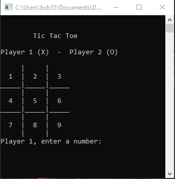

# Tic Tac Toe - C++ Beginner Project

## Description

Simple two-player console game developed using C++. This project was designed to practice CPP basics.

## Running the Code

To run the game, clone or copy the repository down to your local machine. Since this project is contained within the ['main.cpp' file](https://github.com/bcbridges/cpp_tic_tac_toe/blob/main/main.cpp), you can also copy/paste the code directly into a 'main.cpp' file on your machine.

Using your complier of choice, build and run the main.cpp file. Note: I initially ran into issues running the .exe outside of an IDE, but needed to change compiler and linker settings, which I corrected using [this StackOverflow thread](https://stackoverflow.com/questions/6404636/libstdc-6-dll-not-found).

## The Game

The game is a two-player console game, with players taking turns choosing which area of the board they would like to add their mark (X's & O's). The game ends when a user gets 3 of their marks in a straight line, or if there are no more spots to place a mark.

